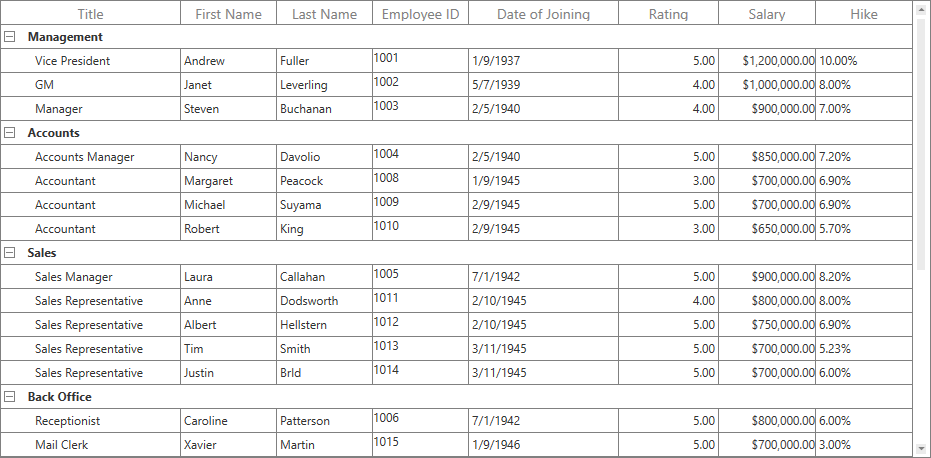

# How to Merge Cells in a Row in WPF TreeGrid?

This example explains how to merge cells in a row in [WPF TreeGrid](https://www.syncfusion.com/wpf-controls/treegrid) (SfTreeGrid).

You can merge the entire column parent node using **TreeGridCoveredCellInfo**.

#### XAML

``` xml
<syncfusion:SfTreeGrid Name="treeGrid"
                       ItemsSource="{Binding EmployeeDetails}"
                       QueryCoveredRange="treeGrid_QueryCoveredRange"
                       SelectionMode="Single"
                       NavigationMode="Cell">
```

#### C#

``` c#
public delegate void TreeGridRequestTreeItemsHandler(object sender, RoutedEventArgs args);

/// <summary>
///  Handles the cell merging in SfTreeGrid.
/// </summary>
public class QueryCoveredRangeBehavior : Behavior<SfTreeGrid>
{
    /// <summary>
    /// Called after the behavior is attached to an AssociatedObject.
    /// </summary>
    /// <remarks>Override this to hook up functionality to the AssociatedObject.</remarks>
    protected override void OnAttached()
    {
        var loader= new TreeGridRequestTreeItemsHandler(AssociatedObject_Loaded);
        loader.Invoke(null, null);
    }

    public  void AssociatedObject_Loaded(object sender, RoutedEventArgs e)
    {
        this.AssociatedObject.QueryCoveredRange += AssociatedObject_QueryCoveredRange;
    }
       
    public void AssociatedObject_QueryCoveredRange(object sender, TreeGridQueryCoveredRangeEventArgs e)
    {
        var treeNode = this.AssociatedObject.GetNodeAtRowIndex(e.RowColumnIndex.RowIndex);
        if (treeNode != null && treeNode.HasChildNodes)
        {
            if (e.RowColumnIndex.ColumnIndex >= 1 && e.RowColumnIndex.ColumnIndex <= this.AssociatedObject.Columns.Count)
            {
                e.Range = new TreeGridCoveredCellInfo(0, this.AssociatedObject.Columns.Count, e.RowColumnIndex.RowIndex);
                e.Handled = true;
            }
        }
    }

    /// <summary>
    /// Calls when the behavior is being detached from its AssociatedObject, but before it has actually occurred.
    /// </summary>
    /// <remarks>Override this to unhook functionality from the AssociatedObject.</remarks>
    protected override void OnDetaching()
    {
        base.OnDetaching();
        this.AssociatedObject.Loaded -= AssociatedObject_Loaded;
        this.AssociatedObject.QueryCoveredRange -= AssociatedObject_QueryCoveredRange;
    }
}

class RequestTreeItemsBehavior : Behavior<SfTreeGrid>
{
    EmployeeRepository viewModel;

    protected override void OnAttached()
    {
        base.OnAttached();
        viewModel = this.AssociatedObject.DataContext as EmployeeRepository;
        this.AssociatedObject.RequestTreeItems += AssociatedObject_RequestTreeItems;
    }

    void AssociatedObject_RequestTreeItems(object sender, TreeGridRequestTreeItemsEventArgs args)
    {
        if (args.ParentItem == null)
        {
            // Gets the root list - Gets all employees who have no boss.
            args.ChildItems = EmployeeRepository.GetEmployees().Where(x => x.ReportsTo == -1); //get all employees whose boss's id is -1 (no boss)
        }
        else //if ParentItem not null, then set args.ChildList to the child items for the given ParentItem.
        {   
            // Gets the children of the parent object.
            Employee emp = args.ParentItem as Employee;
            if (emp != null)
            {
                // Gets all employees who report to the parent employee.
                args.ChildItems = EmployeeRepository.GetEmployees().Where(x => x.ReportsTo == emp.Id);
            }
        }
    }       

    protected override void OnDetaching()
    {
        base.OnDetaching();
        this.AssociatedObject.RequestTreeItems -= AssociatedObject_RequestTreeItems;
    }
}
```


